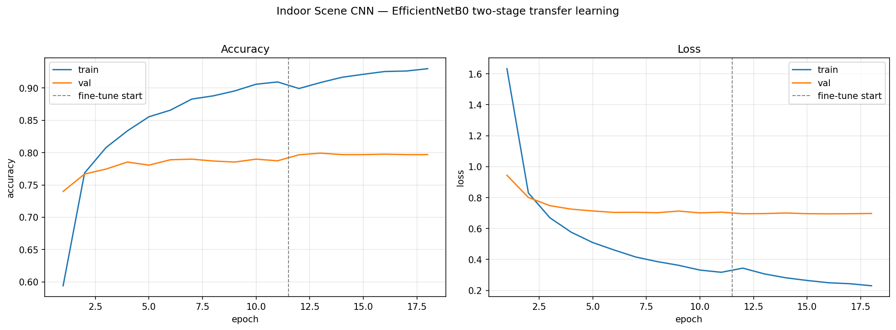
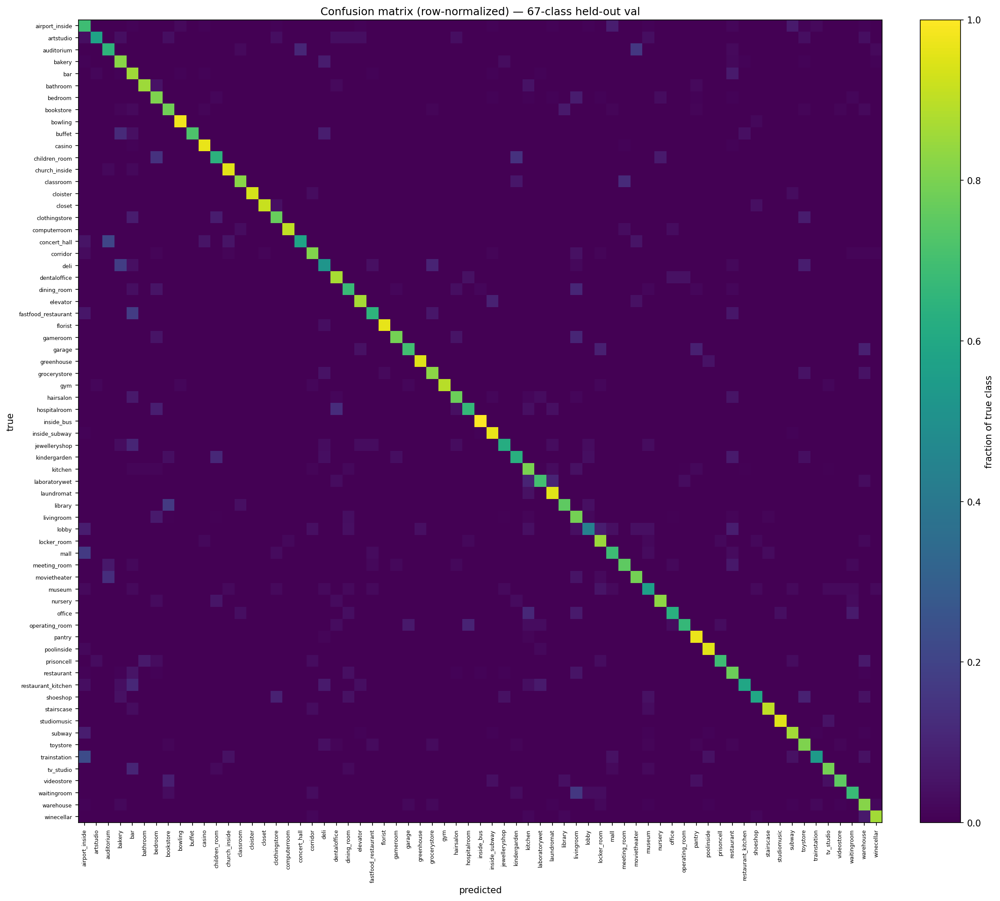
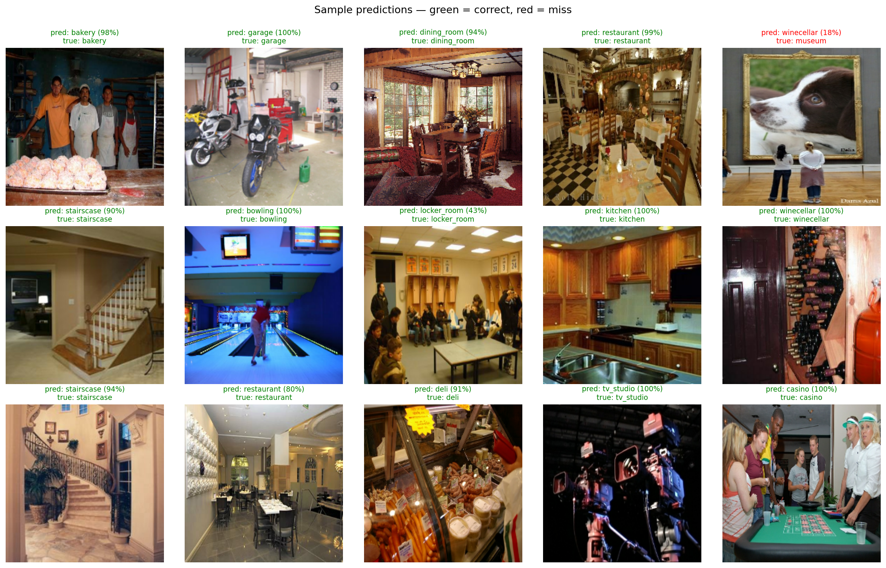
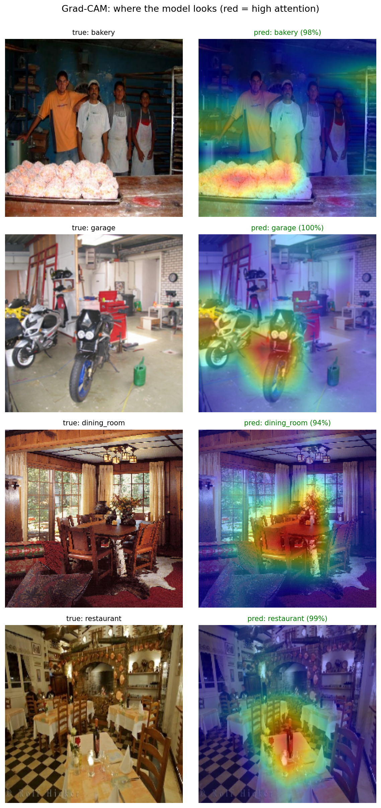

# Indoor Scene Classification (67 classes)

A 67-class indoor scene image classifier built on EfficientNetB0 transfer learning, with honest evaluation, Grad-CAM interpretability, and a live demo.

**Live demo:** [Hugging Face Space](https://huggingface.co/spaces/SamOryeJack/indoor-scene-cnn)

## Results

**79.92% top-1 accuracy, 96.51% top-5 accuracy** on a held-out validation set.

These numbers are reported on a random 80/20 split of the full 15,620-image MIT Indoor Scenes dataset (12,496 training / 3,123 validation images). They are not measured on the official MIT Indoor-67 benchmark split, so they should not be compared directly to published Indoor-67 results.

*Two-stage transfer learning. Mild late overfitting (train around 0.92 vs validation around 0.80), controlled by EarlyStopping.*

*Confusion concentrated on semantically adjacent classes.*

*Predictions with confidence on held-out images.*

*Grad-CAM overlays show the model attending to defining objects rather than background.*

## Evaluation note

Results are reported on a random 80/20 split of the full dataset. The official MIT Indoor-67 train/test split was deliberately not used for scoring. The deployed model was trained on the full dataset, so the official test images were largely seen during training. Scoring the trained model against them would leak training data into the evaluation and inflate the reported accuracy. An honest random-split number is preferred over a misleading benchmark number.

## What the errors look like

The model's mistakes are semantically adjacent and bidirectional rather than random: livingroom and bedroom are confused in both directions, as are bakery and deli, alongside an airport_inside, subway, and mall cluster. There are no embarrassing cross-domain errors. The weakest classes are the ambiguous or low-data ones (lobby, deli, children_room, museum), while distinctive scenes (cloister, florist, casino, gym, inside_subway) are classified reliably. Grad-CAM overlays confirm the model attends to the defining objects of a scene rather than background shortcuts, and prediction confidence tracks difficulty.

## Approach

- Backbone: EfficientNetB0 with ImageNet weights, transfer learning, 224x224 input, batch size 32, seed 42.
- Head: GlobalAveragePooling, Dropout(0.2), Dense(67, softmax), trained with sparse categorical crossentropy.
- Two-stage training: a frozen-backbone stage at learning rate 1e-3, then fine-tuning from block6a_expand_conv onward at 1e-5 with all BatchNorm layers kept frozen. EarlyStopping governs both stages.
- One corrupt image is removed before training (15,620 to 15,619 images).

## Run it

Open the notebook in Colab using the badge above. It downloads the dataset from Kaggle, trains both stages, and reproduces the evaluation, plots, and Grad-CAM. To run the prediction code locally, install the dependencies:

pip install -r requirements.txt

## Dataset and citation

MIT Indoor Scenes (CVPR 2009), 67 categories, 15,620 images. Downloaded via the Kaggle dataset `itsahmad/indoor-scenes-cvpr-2019`.

Quattoni, A. and Torralba, A. Recognizing Indoor Scenes. CVPR 2009.

## License

MIT. See [LICENSE](LICENSE).
